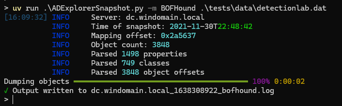
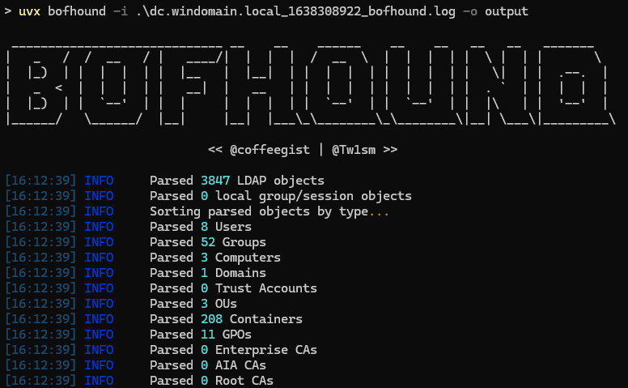

# ADExplorerSnapshot.py


ADExplorerSnapshot.py is an AD Explorer snapshot parser. It is made as an ingestor for [BloodHound](https://bloodhound.readthedocs.io/) via [BOFHound](https://github.com/coffeegist/bofhound), and also supports full-object dumping to NDJSON.

AD Explorer allows you to connect to a DC and browse LDAP data. It can also create snapshots of the server you are currently attached to. This tool allows you to convert those snapshots to BOFHound format or BloodHound-compatible JSON files, or dump all available objects in the snapshot to NDJSON for easier processing.


## What is supported

In `BOFHound` output mode, all attributes for every object are parsed and outputted to BOFHound format (similar to LDIF). This format can then be [parsed with BOFHound](https://github.com/coffeegist/bofhound/):
 * Users collection
 * Groups collection
 * Computers collection
 * Trusts collection
 * OU collection
 * GPO collection
 * Certificate template collection

In `Objects` output mode, all attributes for every object are parsed and outputted to NDJSON format.

In `BloodHound` output mode (deprecated in favor of the more complete BOFHound conversion): 
 * Users collection
 * Groups collection
 * Computers collection
 * Trusts collection
 * Certificate template collection

## Limitations

ADExplorer snapshots contain only information that is retrievable from the LDAP server. This means that features like session and localadmin collection are not available as this tool will not interact with systems on the network. You will only have the data available of the LDAP/DC that you ran the snapshot against.

In `BOFHound` mode, all data is converted to BOFHound format, and is the most complete collection approach.

In `BloodHound` mode, the ingestor processes all data it possibly can from the snapshot (including ACLs), but will only output the JSON data that can be interpreted by BloodHound. GPO/OU collection is missing. 

Trusts collection contains the view as visible from the LDAP DC you are connected to.

## Installation

ADExplorerSnapshot.py supports Python 3.12+. Dependencies are managed via pip.
You can run the tool directly with `uvx` (if missing: `pip install uvx`).

```
uvx git+https://github.com/c3c/ADExplorerSnapshot
```

## Usage

```
usage: ADExplorerSnapshot.py [-h] [-o OUTPUT] [-m {BOFHound,BloodHound,Objects}] snapshot

AD Explorer snapshot ingestor for BloodHound

positional arguments:
  snapshot              Path to the snapshot .dat file.

options:
  -h, --help            show this help message and exit
  -o, --output OUTPUT   Path to the *.json output folder. Folder will be created if it doesn't exist. Defaults to the current directory.
  -m, --mode {BOFHound,BloodHound,Objects}
                        The output mode to use. Defaults to BOFHound output mode, which can then be used with BOFHound. Can also directly output to BloodHound JSON output files (with limitations). In Objects
                        mode all objects with all attributes are outputted to NDJSON.
```

### BOFHound output mode

The BOFHound output mode is the preferred output mode. You can then use the BOFHound tool to ingest the data into BloodHound.

**Typical invocation**:

```
uvx git+https://github.com/c3c/ADExplorerSnapshot -m BOFHound snapshot.dat
uvx bofhound -i .\dc.server.com_1234567890_bofhound.log -o output
```





### BloodHound output mode (deprecated)

Certificate templates can be imported in [BloodHound](https://github.com/BloodHoundAD/BloodHound) format or [BloodHound-ly4k](https://github.com/ly4k/BloodHound) format.
If you use the regular BloodHound version you should only import the `cert_bh` JSON file (which are imported as GPOs). 
If you use ly4k's fork, you should import the `cert_ly4k` files instead. Some information will be omitted (e.g. for ESC8 whether Web Enrollment is enabled) as it cannot be collected with AD Explorer.

## Notes

Making snapshots in AD Explorer is more network-intensive than the traditional BloodHound ingestors as it attempts to retrieve all objects it can from the LDAP.

ADExplorerSnapshot.py will create caches of information for quicker lookups while processing the data. Especially when processing larger snapshots (e.g. 4GB+) you will also need to have sufficient RAM available. In my tests, about half of the snapshot file size was required in RAM.

The library was tested with a number of data sets, please create an issue report if you run into problems. 

The AD Explorer snapshot parser is implemented as its own module, which could also be used individually.

The format in which snapshots are stored by AD Explorer is proprietary and led to a fun reverse engineering journey. A 010 editor template is included in this repository, which I used for iteratively mapping out the contents of the snapshot into structs.

For the BloodHound output mode, this library supports the BloodHound v6 output format. Older versions were supported in earlier commmits if you still need them.
For the old v3 output format, you can use the code in the [v3-format branch](https://github.com/c3c/ADExplorerSnapshot.py/tree/v3-format).

## OPSEC and detection

On an OPSEC-related note, AD Explorer is a legitimate Microsoft tool. When performing a snapshot, only limited queries are made to the LDAP server `(objectGuid=*)`. However, the resultset is huge as all objects and their associated attributes are retrieved. This results in a rather voluminous output. 

Detection of this tool is possible in multiple ways, for which I refer to the excellent blog post by FalconForce: [FalconFriday — Detecting Active Directory Data Collection — 0xFF21](https://falconforce.nl/falconfriday-detecting-active-directory-data-collection-0xff21/).

## License and credits

This code is licensed under the [MIT license](https://opensource.org/licenses/MIT) and makes use of code that is also licensed under the MIT license.

ADExplorerSnapshot.py relies on the following projects:
 - [BloodHound.py](https://github.com/fox-it/BloodHound.py) (the Python BloodHound ingestor): for processing LDAP data.
 - [dissect.cstruct](https://github.com/fox-it/dissect.cstruct) (C-style binary struct parser): for parsing the binary snapshot data.
 - [certipy](https://github.com/ly4k/Certipy) (ADCS enumeration tool): for processing certificate template information.

Credits:
 - Cedric Van Bockhaven for implementation
 - Marat Nigmatullin for the idea
 - The FalconForce team for adding certificate template support
 - Oddvar Moe (@api0cradle) for contributing various scripts
 - Marc André Tanner (@martanne) for implementing BOFHound output mode

Thanks to Deloitte for providing the environment in which this tool was developed.
